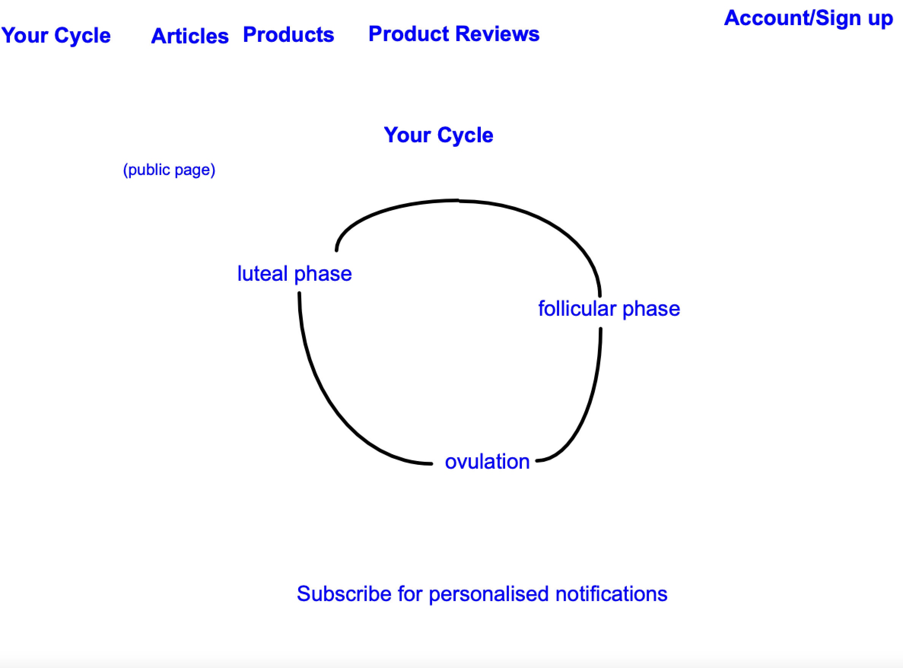

# Periodic - A menstrual tracking website 

The idea to create this website has been born from the need for women to track their period for physical health, mental health and family planning. There are many menstrual tracking apps out there, but they mostly aim their content towards adults and there is a need for more child friendly versions or versions that are sensitive toward cultural and religious attitudes toward sex, therefore providing minimal sexual content. 
The website aims to provide information relevant to various stages of the menstrual cycle, to educate women and girls on how it effects them and how to make the most of each phase. The website will also do product reviews and sell products as a source of revenue. 
The website will present itself a in a gender neutral way to be inclusive of all menstruating people.

## Features

* Navigation bar
* Menstrual calendar
* Registration and account
* Shop
* Product reviews

## Possible Future Features
* Product placement appropriate to the time of month within the profile page
* Subscription mode to opt out of profile adverts
* Personalised email notifications for each phase of the month
* Add search function for whole site, and/or article page
* Community Forum
* More accurate tracking capabilities (keeping it simple for the time being)

## User goals
### First time user
Discover information about menstrual cycle
Read Product reviews
Buy products
Sort through products
Learn about cycle

### Regular User
Get personalised information about cycle
Buy menstrual products
Sort through products
Learn about cycle
Edit details
Have personal information stored (for tracker, payment details and address for postage)
            
## Site owner goal 
Sell products
Advertise products

## Wireframes

## Development

#### Problem
Could not get the navbar dropdown menu to display the options. I ensured the javascipt was working by adding another elsewehere and checked multiple times that the format matched the documentation and the working example on the products page (categories selection box), I shifted the elements around and tried them in different places.
#### Solution
I had been looking at the wronh html elements adding the links to the wrong elements.

#### Problem
price sort was not working with category sort. It was resetting the category selection.
#### Solution

#### Problem
Could not get the innerHTML to change when selecting sorting options
#### Solution

#### Problem
Pants category only shows a few pants in main search area because there needs to be an overall 'pants' category
#### Solution

#### Problem
The paragraph breaks were not working in the descriptions of the products.
#### Solution
A bit of research into tamplate language documentation revealed that I needed to use "product.description|linebreaksbr"

#### Problem
The materialize select box is not working
#### Solution
I had put the data-target id in the wrong unordered list.

#### Problem
When adding 2 of the same product but in different sizes to see if they register as seperate items in the basket, they registered as only one and didn't display the sizes selected
#### Solution
After checking the local variables on the error page displayed on the webserver, I discovered that the 'item_with_size' should have been names 'item_size' in order to get the correct information for the code to work.

#### Problem
Subtotal and grand total prices were not working. Grand total price had previously worked but now doesn't since adding sizes to the views function and context processor. I think the grand total maybe never worked perfectly. it seems to be increasing but not in a logical manor. I moved "basket = request.session.get('basket', {})" because i thought it was in the wrong place in the basket view, but it didn't totally fix the problem. I found that one line had "request.session.post" when it should have been "request.post", but it still didn't seem to solve the issue.
#### Solution
I deleted the delivery cost percentage and calculation that was inspired by the boutique-ado project and created my own delivery parameters. I then added a subtotal variable to the basket_item dictionary and spotted that the "total" variable needed an extra "+" before the "=" in the variable creation. this fixed the issues.

#### Problem
Removing items only works with items that don't have sizes
#### Solution
The key value for the item with sizes was incorrectly spelt.

#### Problem
Editing the quantity wasn't working and redirecting to a page error 
#### Solution
One of the django template links ended with }} rather than %}. The issue was fixed after changing the typo. On closer inspection, the update was working for only the first item in the basket. The problem turned out to be that id attributes were used for the elements, when class attributes need to be used as these elements were replicated for every item added, so more than one were displayed. Once the javascript was updated to retrienve the array of items with a class name rather than a single element with an id attribute, the function worked with all items.

#### Problem
Display of the your_cycle articles were working and randomly stopped working.
#### Solution
The modal wasn't working because the id attribute was long and broken up onto different lines. The modal worked once put onto the same line.

#### Problem
Could not get card-error to work
#### Solution
Needed attribute role to be "alert"

#### Problem
Stripe payments were being created but not succeeding
#### Solution
The javascript was not picking up the submit event, so I changed the event listener to listen to the submit button rather than the form.

#### Problem
Stripe payments were being processed but price-totals not directing to order info in admin/database
#### Solution
Grand total was not being calculated in the models.py. it was an easy fix to just add the appropriate calculation.

#### Problem
Delivery cost is not properly represented in the admin. It looks as if the delivery cost is being calculated in models.py by counting the number of products, including products with different sizes, rather than the number of items
#### Solution
To calculate the total number of items, I took some code from boutique-ado's example and customized for this site.

#### Problem
Trying to set up javascript function to save deliver and billing info to the database was stopping the checkout function from working as it did not recognise the values being requested.
#### Solution
The shipping parameters didn't match the ones laid out in the stripe documentation. I also had to change the country field in models.py from charfeild to countryfield and import it from django_countries

#### Problem
Terminal presented this on chckout compltion: (checkout vid 15)
Bad Request: /checkout/webhooks/
[07/Oct/2022 12:27:12] "POST /checkout/webhooks/ HTTP/1.1" 400 0
#### Solution
The secret stored in gitpod settings variables had a different name to the variable called in settings.py. There was also an issue with county being referred to as county and not state

#### Problem
Payment intent is called before defined
#### Solution
This happens if the full name field is empty

#### Problem
Cannot use the materialise grid system on the form elements
#### Solution
Chose to delete materialise form elements as it was causing too many problems with styling for this time frame.

#### Problem
Placeholders in materialize styled forms are incorrect. It seems that the form won't use my customised code when used in conjunction with materialize
#### Solution
Chose to delete materialise form elements as it was causing too many problems with styling for this time frame.

#### Problem
Some article categories don't need to be added, but should be allowed to be editted. For examply the 'cycle_phases' info that shows on the home page should not be added or deleted but may need to be updated to keep up with scientific developments in knowledge.
#### Solution

#### Problem
Checkout wouldn't work if user was not logged in.
#### Solution
This was because it couldn't detect any value for the save-info box. I had written the code in javascript and chose to change it to jquery like in the boutique-ado project and it worked after that

#### Problem
The profile cycle information doesn't work well if bad dates are selected
#### Solution
The date picker needs min and max dates added, which was not doable with the materialise css forms. It will be easier to fix this with the standar form inputs, time-permitting.

## Testing
### Validators

### Ongoing Problems

## Deployment
* Created a new app called menstrual-tracker in heroku with region set to Europe.
* Selected Heroku Postgres free hobby data base in add-ons in the resources tab.
* Installed dj_database_url using pip3 install
* Installed psycopg2-binary using pip3 install
* Imported dj_databas_url to settings.py
* Set up the default database using dj_database_url and parsing it the app url.
* Migrated the data to postgres using 'python3 manage.py migrate'
* loaded fixture data to database although I accidentally did the products before category.
* installed gunicorn
* Froze the requirements into requirements.txt
* Created Procfile
* added menstrual-tracker app to allowed_hosts in settings.py
* I had to create a runtime.txt file and put an earlier version of python into it to push to heroku main
* Commit changes an pushed to heroku main
* set up a bucket in AWS
* install boto3
* install django-storages
* freeze to requirements.txt

## Credits

### Media
Product item images were taken from PixaBay
Content from my friend's incredibly informative website - https://publish.obsidian.md/sarah-keates-andrews/_home+page

### Libraries
Materializecss.com

https://fonts.google.com/

### Languages Used

### References 
The circular cycle_phases links were taken from codepen.

Many thanks to the tutors and my personal mentor from code institute. The provided a great support for me to get through this course.
